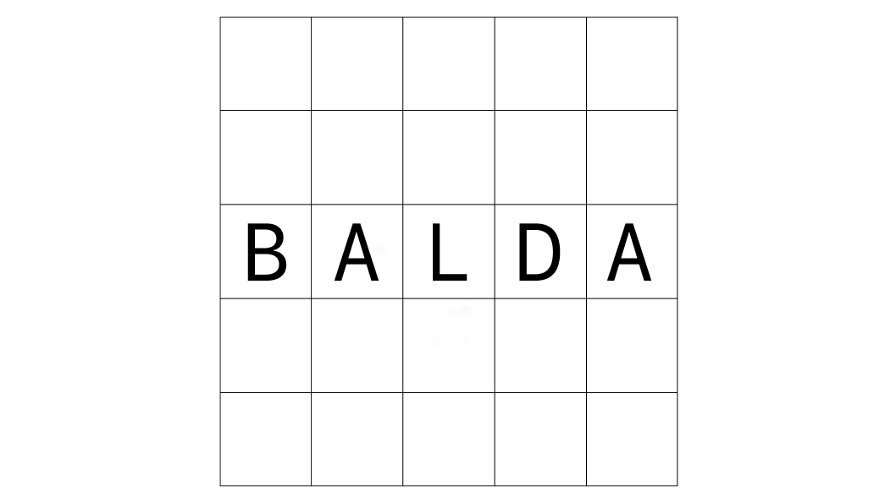
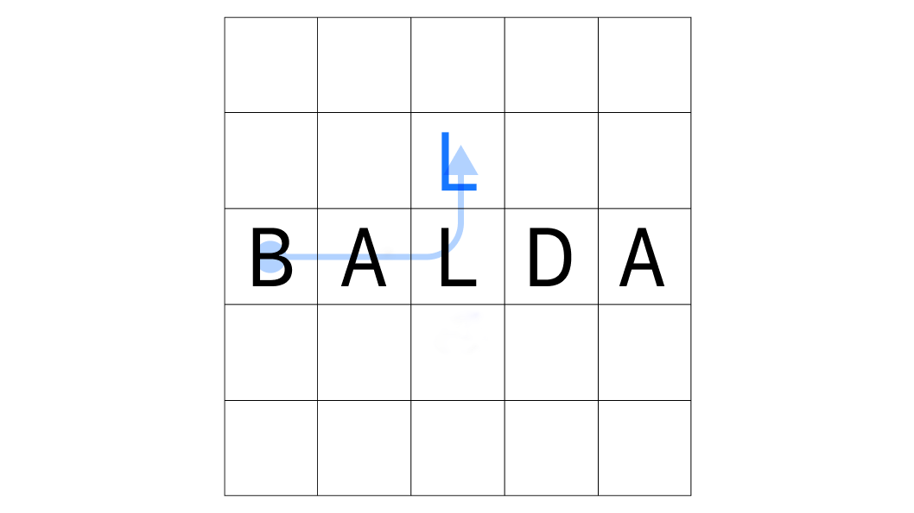
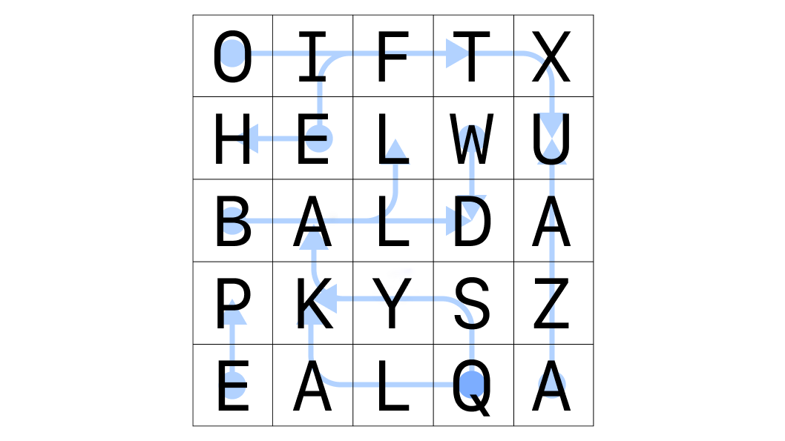
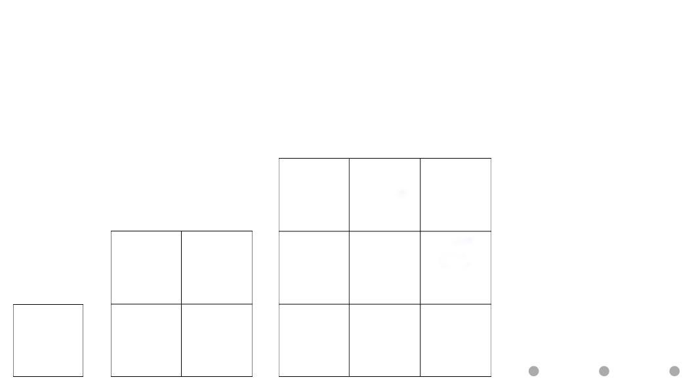
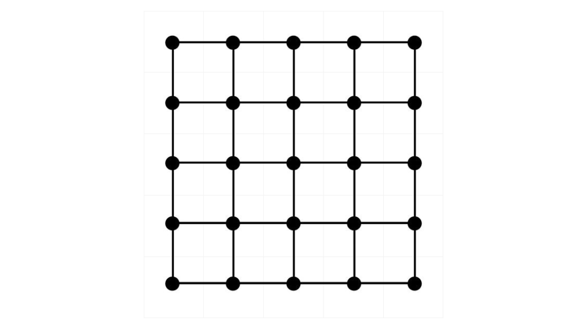

In Russia there is such an old but fascinating board game - “Balda”. Its gameplay involves forming words on a square game board. The game is usually designed for 2-4 players, and although it has many variations, the most popular version involves forming words by moving from letter to letter at right angles.

As the game progresses, players take turns exploring all possible combinations of letters on the board within the rules of the game, ultimately forming a word by adding one letter to those already set on the board previously. Moreover, it is important to note that the word does not have to go from right to left and from top to bottom; it can even go like a snake.

We are considering the limiting case when the entire playing field is filled with letters and we need to go through all possible letter combinations allowed by the rules to find words. Let's assume that a word is any combination of letters that are allowed by the rules of the game, even meaningless ones (such as "gggggg", "ababab" or a lonely "y"). Therefore, the task consists first of all in **listing all possible combinations of letters allowed by the rules of the game**. The complexity of this task suggests that the computer can outperform the human player here.

In its original form, the playing field of "Balda" is a 5x5 grid of cells. To estimate the maximum number of words that can be generated in such a field, we can use an iterative approach. This method starts by counting the words that can be found in a 1x1 box and then expands to 2x2, 3x3, and so on.

**The ultimate goal** is to find a formula f(n) that reveals the relationship between the possible number of words and the problem size n. This formula can be useful not only for estimating the maximum possible number of words in a 5x5 box, but also for extrapolating it to larger grids like 10x10 or even a whopping 100x100.

In an effort to estimate the maximum number of words that can be formed in the board game "Balda", we turn to mathematical approaches. Although the game itself is strategic and linguistic, it is also a mathematical problem when viewed through the lens of graph theory.

To solve this problem, we consider the Balda grid as a square [lattice graph](https://en.wikipedia.org/wiki/Lattice_graph). In this graph, the vertices are the cells with letters, and the edges are the allowable movements between the cells. **The goal now is to identify all paths within this graph that do not contain cycles** — a classic problem in graph theory.

The final formula for the maximum possible number of words in Balda at different grid sizes has not yet been found, so research is ongoing. But the following estimates were experimentally obtained for different dimensions:

| Dimension | Number of all pathes | Computation time |
| --------: | -------------------: |-----------------:|
| 1х1       | 1                    |        0 seconds |
| 2х2       | 28                   |        0 seconds |
| 3х3       | 653                  |        0 seconds |
| 4х4       | 28512                |        0 seconds |
| 5х5       | 3060417              |        0 seconds |
| 6х6       | 873239772            |        6 seconds |
| 7х7       | 687430009069         |     6535 seconds |